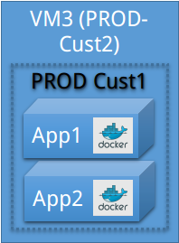
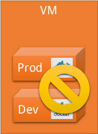

# Docker Container

A **Docker Container** is a **Docker Image** being run on a **Docker Host**.

## Distribution of Containers

Out of security reasons, you MUST use separate Docker Hosts for each customer, product/solution or environment.

You **MAY** put ALL containers of ONE product for ONE customer on a single Docker Host.

If a product is deployed as as set of one or more containers,
you **MUST** create as many Docker Hosts as you have different parties:

If required, any solution/product containers **MAY** be deployed to different machines, as long as **all containers on each machine** belong to the **same owner and environment**.

You **MUST NOT** deploy containers from different customers, products/solutions or environments **on a single Docker Host**.

## Use `PORTS` only if necessary

A **Docker Container**  permits other containers on the same network to access  its services by using the EXPOSE statement in a [Dockerfile](Dockerfile.md) or the `expose:` in a [docker-compose.yml](DockerCompose.md)

Dockerfile

	FROM ubuntu:14.04.1
	EXPOSE 3000 4000

docker-compose.yml

	serv:
		image: ubuntu:14.04.1
		expose:
		- "3000"
		- "4000"

This still does not allow access to the ports from outside the **Docker Host**. Out of security reasons, you **MUST** only listen/open ports on the **Docker Host** that are necessary for the intended service functionality.

Even when the samples (above) are exposing the correct ports, it is only allowed to open port `4000` on the host, if port 3000 is not required (from the outside).

Docker Engine

	$ docker run <image> -p "4000:4000" ...

Docker Compose

	serv:
		image: ubuntu:14.04.1
		expose:
		- "3000"
		- "4000"
		ports:
		- "4000:4000"

## Persistent Container data

If a container is writing to files at runtime, the file contents are present only inside THAT container and ONLY WHILE THE CONTAINER IS NOT DESTROYED (`docker rm ...`).

With a [Docker Volume](https://docs.docker.com/engine/userguide/containers/dockervolumes/), it would be possible to use the [Docker Host](DockerHost.md)'s file system to solve that problem. That would directly link the Docker Hosts installation (operating system, directory structure, permissions, ...) to the Docker Container.

To avoid dependencies to specific Docker Host configurations, you **MUST** use a Data Volume container and use its volumes.

