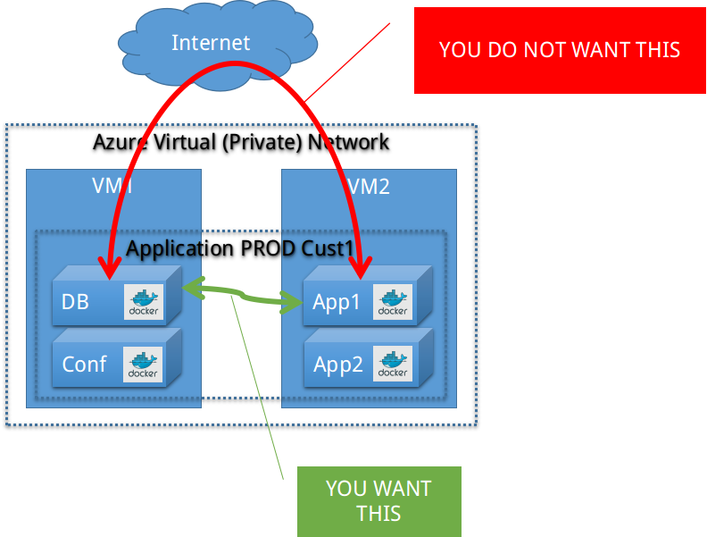

# Docker Machine / Docker Swarm

According to the [**Docker Machine** overview](https://docs.docker.com/machine/overview/), you can use Docker Machine to:

* Install and run Docker on Mac or Windows
* Provision and manage multiple remote Docker hosts
* Provision Swarm clusters

One of the most interesting features for "quick, but secure" Docker Hosts is the ease of getting [Encrypted Connections between **Docker Engines**](DockerEngine.md#enforce-encrypted-ssl-connections-to-the-docker-daemon-api) right.

## Disable Crash-Reporting on Production systems

You **MUST NOT** automatically/uncontrolled send chunks of information about the system, inner workings,  configurations or running programs to any external party (even if it is to "Docker Inc." or one of its services).

To prevent Crash Reporting from happening, you ...

> [...] can create a no-error-report file in your $HOME/.docker/machine directory, and Docker Machine will disable this behavior. e.g.:

>		$ mkdir -p ~/.docker/machine && touch ~/.docker/machine/no-error-report

> Leaving the file empty is fine -- Docker Machine just checks for its presence.

For more information see the documentation at [Crash Reporting](https://docs.docker.com/machine/concepts/#crash-reporting)

## Beware of Driver restrictions

While Docker Machine is one of the most convenient methods to create new Docker Hosts in the Cloud, it fails in some areas.

You **SHOULD NOT** use Docker Machine (0.6) to create a Docker Host in Azure, because you can't define a resource group or a virtual network and the result is always one "standalone" machine that has to communicate over its public endpoints.

